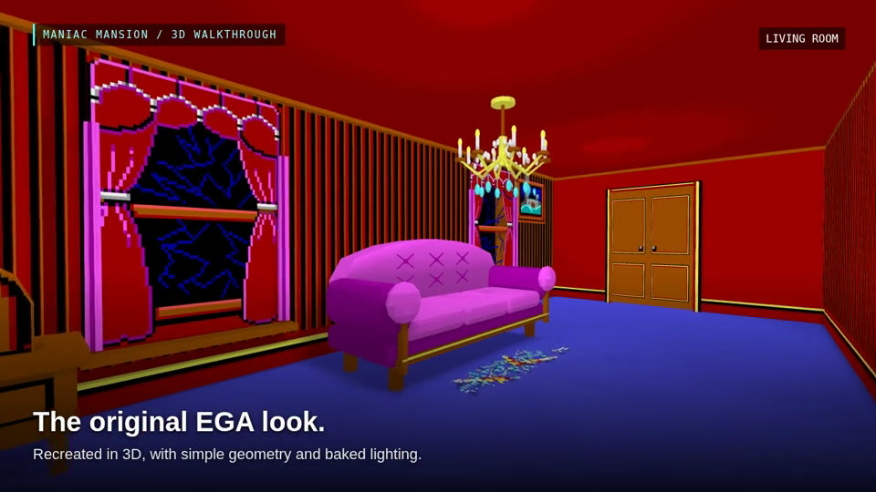

# Maniac Mansion in 3D

Walk through the [Maniac Mansion](https://en.wikipedia.org/wiki/Maniac_Mansion) house in your browser. This fan project reimagines the original EGA backgrounds as connected 3D spaces, keeping their distinctive colors, furniture and odd little details while letting you look beyond the original camera angle.

**[Explore the mansion →](https://s-macke.github.io/maniac-mansion-3d/)**

| Original EGA artwork | Recreated in 3D |
|:---:|:---:|
| [](https://s-macke.github.io/maniac-mansion-3d/) | [](https://s-macke.github.io/maniac-mansion-3d/) |

Click either image to explore the mansion.

https://github.com/user-attachments/assets/97f56075-cd70-4319-b6c8-3dcc580e6338

## Explore the house

Start outside, walk up the porch steps and open the front doors. From the entrance hall, explore 34 room spaces: the library and kitchen, bedrooms and attics, the observatory, the cellar laboratories, and the pool and garage. Drain the pool to climb down into its basin, or follow a ladder to another floor.

This is a first-person architectural walkthrough. There are no puzzles to solve, inventory items to collect or characters to control. Doors, ladders and hidden passages let you explore without playing through the original game's puzzles.

The rooms are modeled from the original artwork with simple geometry and soft baked lighting. Some dimensions, unseen walls and connections are interpretations: the original painted backgrounds do not describe a single physically consistent building. Doorway portals let rooms retain their own proportions while remaining connected as you walk through them.

## Jump to a room

These links start you in the selected room, with the rest of the house still connected. The pool link starts on the deck; drain the pool there to explore the basin.

| Area | Rooms |
|---|---|
| Outside | [Front exterior](https://s-macke.github.io/maniac-mansion-3d/?room=front_exterior) · [Pool deck](https://s-macke.github.io/maniac-mansion-3d/?room=pool) · [Garage and forecourt](https://s-macke.github.io/maniac-mansion-3d/?room=garage) |
| Ground floor | [Entrance hall and landing](https://s-macke.github.io/maniac-mansion-3d/?room=hall) · [Living room](https://s-macke.github.io/maniac-mansion-3d/?room=living_room) · [Kitchen](https://s-macke.github.io/maniac-mansion-3d/?room=kitchen) · [Dining room](https://s-macke.github.io/maniac-mansion-3d/?room=dining_room) · [Pantry](https://s-macke.github.io/maniac-mansion-3d/?room=pantry) · [Library](https://s-macke.github.io/maniac-mansion-3d/?room=library) |
| Above the entrance | [Art studio](https://s-macke.github.io/maniac-mansion-3d/?room=plant_room) · [Music room](https://s-macke.github.io/maniac-mansion-3d/?room=music_room) · [Security corridor](https://s-macke.github.io/maniac-mansion-3d/?room=security_hall) · [Medical room](https://s-macke.github.io/maniac-mansion-3d/?room=medical_room) · [Arcade](https://s-macke.github.io/maniac-mansion-3d/?room=arcade) · [Windowed stair hall](https://s-macke.github.io/maniac-mansion-3d/?room=windowed_hall) · [Photo room](https://s-macke.github.io/maniac-mansion-3d/?room=photo_room) |
| Bedrooms and upper corridor | [Upper corridor](https://s-macke.github.io/maniac-mansion-3d/?room=upper_corridor) · [Radio bedroom](https://s-macke.github.io/maniac-mansion-3d/?room=radio_bedroom) · [Heart bedroom](https://s-macke.github.io/maniac-mansion-3d/?room=heart_bedroom) · [Green bedroom](https://s-macke.github.io/maniac-mansion-3d/?room=green_bedroom) · [Mummy room](https://s-macke.github.io/maniac-mansion-3d/?room=mummy_room) · [Mummy bathroom](https://s-macke.github.io/maniac-mansion-3d/?room=mummy_bathroom) · [Typewriter room](https://s-macke.github.io/maniac-mansion-3d/?room=typewriter_room) |
| Attics and roof | [Safe attic](https://s-macke.github.io/maniac-mansion-3d/?room=safe_attic) · [Green Tentacle’s room](https://s-macke.github.io/maniac-mansion-3d/?room=tentacle_room) · [Hidden attic stairs](https://s-macke.github.io/maniac-mansion-3d/?room=attic_stairs) · [Wire attic](https://s-macke.github.io/maniac-mansion-3d/?room=wire_attic) · [Observatory](https://s-macke.github.io/maniac-mansion-3d/?room=observatory) |
| Cellar and laboratories | [Cellar](https://s-macke.github.io/maniac-mansion-3d/?room=cellar) · [Under-house passage](https://s-macke.github.io/maniac-mansion-3d/?room=under_house) · [Dungeon](https://s-macke.github.io/maniac-mansion-3d/?room=dungeon) · [Outer laboratory](https://s-macke.github.io/maniac-mansion-3d/?room=outer_lab) · [Main laboratory](https://s-macke.github.io/maniac-mansion-3d/?room=main_lab) · [Meteor chamber](https://s-macke.github.io/maniac-mansion-3d/?room=meteor_chamber) |

## Controls

| Action | Desktop |
|---|---|
| Walk | **WASD**, or **↑ / ↓** |
| Walk faster | Hold **Shift** |
| Look around | Click the scene and move the mouse, or drag; **← / →** turn |
| Open or close doors, use ladders and other interactions | Approach, aim and press **E** |
| Pause / release the mouse | **Esc** |
| Reset position | **R** |

On touch devices, use the directional buttons, drag to look, and tap the contextual action button. Doors start closed; the introductory controls hint disappears after you begin walking.

## Run locally

A fresh checkout contains the source artwork and builders. Generate the models and website first using **Docker with Compose**:

```bash
git clone https://github.com/s-macke/maniac-mansion-3d.git
cd maniac-mansion-3d
./docker-build.sh all
```

The container includes Blender, Python and npm. The first build bakes all rooms and can take tens of minutes. Then serve the finished website with Python 3:

```bash
python3 -m http.server 5174 --bind 127.0.0.1 --directory web/dist/client
```

Open **http://127.0.0.1:5174/**.

If Node.js is installed, `./walkthrough.sh` can serve the built site instead. For building without Docker, see the [local toolchain and rebuild instructions](docs/rebuilding.md).

## How it is built

Blender Python builders generate the room geometry, bake the lighting and export compact GLB models. A Three.js viewer assembles the rooms in the browser, reuses shared door and ladder assets, and loads connected spaces as needed. Lighting is baked into the assets; the browser does not need global illumination.

The result is a static website with no backend. Asset URLs are relative, so the same build can run at a domain root or in a subdirectory. The [GitHub Pages workflow](docs/github-pages.md) generates the Blender assets, compiles and checks the website, and deploys from `main` when manually started with **Actions → Build and deploy GitHub Pages → Run workflow**.

| Location | Contents |
|---|---|
| [`source/`](source/) | Original background references |
| [`rooms/`](rooms/) | Per-room Blender builders, configuration and notes |
| [`shared/`](shared/) | Reusable door and ladder builders |
| [`house/layout.json`](house/layout.json) | Room spaces and connections |
| [`scripts/`](scripts/) | Asset generation, baking and build tools |
| [`web/`](web/) | Browser viewer, navigation and tests |
| `generated/` | Local Blender scenes, models, reports and previews; ignored by Git |

After the initial build, rebuild just one room and the website with:

```bash
./docker-build.sh room kitchen --site
```

For viewer development, use `./walkthrough.sh dev` with Node.js 22.13 or newer. See the [Docker guide](docs/docker.md) for incremental builds and the [architecture guide](docs/architecture.md) for where changes belong.

## Further reading

- [Artwork, palette and reference documentation](docs/README.md)
- [Room connections and uncertain routes](docs/connection_map.md)
- [Doorway portals](docs/portals.md) and [ladder connections](docs/ladders.md)
- [Browser build, controls and validation](web/README.md)
- [Source-only rebuilds](docs/rebuilding.md) and [GitHub Pages deployment](docs/github-pages.md)
- [Project plan and development history](PLAN.md)

## Credits

Maniac Mansion and its original artwork were created by Lucasfilm Games. This is an unofficial fan reconstruction; the original game and artwork belong to their respective rights holders.
