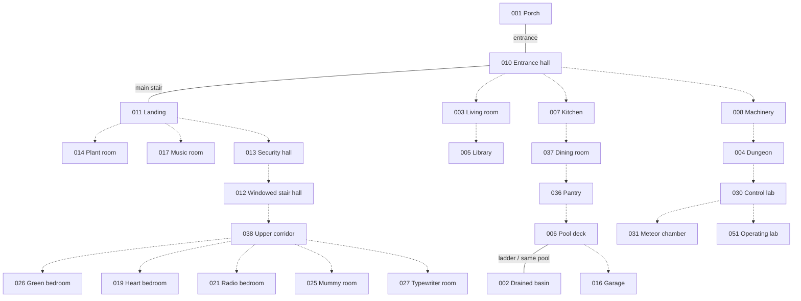

# Initial house connection map

Basis: [supplied cutaway](../source/connection_suggestion.png), matched against [all background images](../generated/reference/room_inventory.md). This is a proposed walkthrough topology, not a verified map of the game's scripts. Use the cutaway for arrangement and the original room PNGs for colors and details; the two differ visibly.

## Implemented connection

User-approved on 2026-09-10: **010 entrance + 011 landing are one continuous double-height hall**, joined by the big staircase. The landing gallery is 3.36 m above the entrance floor and overlooks it. This is the chosen 3D interpretation of the supplied artwork; adjacent closed-door destinations remain deferred. See [connected hall model](../rooms/connected_hall/README.md).

## How to read this map

- **Visible**: the supplied art directly supports the relationship, such as the pool ladder. This does not mean verified in the game engine.
- **Suggested**: room placement and exit cues support a plausible connection, but the destination is inferred.
- **Unresolved**: the reference does not establish a usable route. Do not build a doorway from this alone.

All proposed walking links are bidirectional. Pipes, wires, telescope sightlines, and mere vertical alignment are not walking links. Door locks and character restrictions will not apply to this walkthrough.

## Spatial arrangement from the cutaway

These are illustration bands, **not yet measured building storeys**. Overlapping rooms may occupy different depths or half-levels.

| Cutaway band, bottom to top | Matching backgrounds |
|---|---|
| Deep underground | 031 meteor chamber, 030 control laboratory, 051 operating laboratory |
| Upper underground | 004 dungeon, 008 machinery; 002 pool basin farther right |
| Directly beneath porch | 029 pipe corridor |
| Ground / garden | 001 porch, 010 entrance, 003 living room, 005 library; 006 pool and 016 garage to right |
| Above ground rooms | 007 kitchen, 037 dining room, 036 pantry |
| Left wing / stair area | 014 plant room, 011 landing, 017 music room |
| Lower tower | 013 security hall; 022 medical room and 018 arcade above it |
| Middle tower | 012 windowed stair hall; projecting room tentatively 009 |
| Upper corridor | 038 four-door hall, 027 typewriter room at right |
| Bedroom band | 026 green bedroom, 019 heart bedroom, 021 radio bedroom, 025 mummy room |
| Roof rooms | 020 speakers, 023 workshop, 024 bathroom; 015 attic above bathroom |
| Dome | 028 observatory |

The library's spiral stair and several ladders have no unambiguous destination in this drawing. The long right-hand underground passage/shaft is visible in the cutaway but has no clearly matched standalone background. Retain it as an unresolved connector, not an invented numbered room.

## Core route diagram

Solid lines are visible relationships; dotted lines are suggested links. The complete candidate table below includes branches omitted from this compact diagram. Edge labels do not assign exact door slots.

## Connection candidates and evidence

Do not interpret left/right image positions as world directions. Exact door-slot assignments remain to be established in blockout.

| Pair | Status | Evidence / limitation |
|---|---|---|
| 001 ↔ 010 | Visible | Front double entrance corresponds to entrance hall's double door; shown at porch level in cutaway. |
| 010 ↔ 011 | Visible | Entrance stair rises to the landing over it in the cutaway; landing foreground is open to the stair. |
| 006 ↔ 002 | Visible | Pool rim, ladder and pool setting identify deck and basin of the same structure. This is one pool, not a second room volume. |
| 010 ↔ 003 | Implemented interpretation | Hall right-side door ↔ living-room left door. The cutaway suggests this adjacency; doorway positions are aligned in the 3D prototype. |
| 003 ↔ 005 | Suggested | Living room and library are adjacent in cutaway; double-door cues are compatible. |
| 010 ↔ 007 | Implemented blockout interpretation | Hall rear-left door meets kitchen left-end door at ground level; kitchen extends behind the hall beneath the gallery at its entrance. |
| 007 ↔ 037 | Implemented blockout interpretation | Kitchen far door connects directly to the dining left door at ground level. |
| 037 ↔ 036 | Suggested | Pantry is at dining room's right end; both supply doorway cues. |
| 036 ↔ 006 | Suggested | Pantry's outer mesh door is a plausible pool exit; deck has house-side door. |
| 006 ↔ 016 | Suggested | Pool deck and garage share the exterior in cutaway; garage's open front reaches outdoors. |
| 001 ↔ 006 | Suggested | Exterior route around house is plausible; fence/gate routing is not established. |
| 010 ↔ 008 | Suggested | Machinery stairs rise toward house in cutaway; exact entrance door unassigned. |
| 008 ↔ 004 | Suggested | Neighboring underground spaces with compatible side doors. |
| 004 ↔ 030 | Suggested | Dungeon and lab occupy adjacent underground bands; secure exit is plausible, connecting geometry unspecified. |
| 030 ↔ 031 | Suggested | Deep-band adjacency and compatible doors. |
| 030 ↔ 051 | Suggested | Deep-band adjacency and compatible doors. |
| 011 ↔ 014 | Suggested | Plant room sits left of landing; room has a single door. |
| 011 ↔ 017 | Suggested | Music room sits right of landing; room has a single door. |
| 011 ↔ 013 | Suggested | Candidate onward route into tower/security corridor; secure-door cues support it, but continuous geometry is unclear. |
| 013 ↔ 022 | Suggested | Medical room lies above security corridor; rear door could meet that circulation. |
| 013 ↔ 018 | Suggested | Arcade lies above corridor's right end near stairs; its door could meet a landing. |
| 013 ↔ 012 | Suggested | Both are circulation spaces with stairs in lower/middle tower; proposed sequence, not proven endpoint mapping. |
| 012 ↔ 038 | Suggested | Left stair rises toward upper corridor in cutaway; exact intermediate landing unresolved. |
| 038 ↔ 026 | Suggested | Bedroom above corridor; one of four rear doors is a candidate. |
| 038 ↔ 019 | Suggested | Bedroom above corridor; one of four rear doors is a candidate. |
| 038 ↔ 021 | Suggested | Bedroom above corridor; one of four rear doors is a candidate. |
| 038 ↔ 025 | Suggested | Mummy room above corridor's right end; assignment to fourth rear door is provisional. |
| 038 ↔ 027 | Suggested | Typewriter room appears at corridor's right end and has a left door. |
| 025 ↔ 024 | Suggested | Bathroom sits above mummy room in cutaway; spare mummy-room door is a possible route. No connecting stairs shown in background. |
| 024 ↔ 015 | Unresolved | Attic is above bathroom and has a floor hatch; bathroom image does not show its counterpart. |
| 021 ↔ 023 | Unresolved | Radio-bedroom ladder and workshop floor panel are candidate counterparts; cutaway placement does not prove pairing. |
| 019 ↔ 009 | Unresolved | Bedroom ladder and boarded/projecting room are possible related spaces, but room 009 placement itself is low confidence. |
| 026 ↔ 020 | Unresolved | Speaker room sits above green bedroom; no connecting exit is visible in either image. Adjacency alone is insufficient. |
| 023 ↔ 028 or 014 ↔ 028 | Unresolved alternatives | Dome requires an approach; workshop's roof position and plant-room growth motif are clues only. No route is selected. |
| 029 ↔ 008 and/or 001 | Unresolved | Pipe corridor below porch needs an access point; neither endpoint nor hatch is explicit. |
| 051 ↔ exterior shaft | Unresolved | Cutaway shows a long underground extension to the right; no matching corridor background or established shaft entrance. |
| 044 / 047 ↔ grounds | Reference only | These are exterior compositions, not proof of additional doors or distinct room volumes. |

## Questions to resolve before full-house blockout

1. Map entrance doors and upper-corridor door slots to destinations; the PNGs contain no destination metadata.
2. Resolve the tower circulation (011/013/012/038), distinguishing depth offsets from actual floor changes.
3. Establish access to 009, 020, 023, 028 and 029. They remain inventory entries even though the initial map cannot establish their routes.
4. Identify the library spiral stair destination; do not add a duplicate stair route arbitrarily.
5. Pair attic hatches and bedroom ladders. Confirm whether 009 is the projecting gray room.
6. Decide whether the long cutaway-only underground connector is needed to access modeled areas.

These are recorded uncertainties, not requests to stop step 1. For step 2 the entrance can be modeled with labeled destination placeholders; do not lock the complete house topology yet. Suggested initial second room: **011 landing**, since the main stair relationship is directly supported; use 003 living room for a simpler doorway-only prototype if desired.

## Connected doorway prototype

The hall port `right_side` at `(6.4, 3.15, 0)` meets living-room port `left_door` at local `(-6.4, 3, 0)`. Living-room placement is `(12.8, 0.15, 0)`, yaw 0. Both door openings are 1.05 m wide and 2.75 m high. The shared wall lies on either side of that threshold plane; the red and blue floors meet without overlap. This placement follows the supplied cutaway interpretation, not verified game-script coordinates.

## Front entrance prototype

001 ↔ 010 is now implemented: exterior `front_door` `(0,0,0)` at placement `(-6.4,2.35,0)`, yaw `-pi/2`, meets hall `entrance` `(-6.4,2.35,0)`. Width is 1.85 m, height 3.18 m. Both front door leaves remain visible, open into the hall. The approach starts 1.2 m below the porch and reaches it via eight steps. Other exterior routes remain unresolved.

The exterior now also models the metal grating behind the left stair-side bush. It is recorded as the closed `under_porch_grating` port, without an assigned destination. This preserves the visible opening for a later under-porch route without treating it as an active walking connection yet.

## Kitchen shell connection

Kitchen `hall_door` local `(-6.4,2.9,0)` at placement `(-0.82,12.9,0)`, yaw `pi/2`, meets hall `rear_left` `(-3.72,6.5,0)`. Both openings are 1.3 m wide and 2.83 m high. Hall v5 owns the shared leaf, closed initially and openable from either side. The shell ceiling is 3.12 m; its entrance sits under the gallery rather than on a new storey. This is an explicit interpretation for layout review.

Kitchen's far `dining_door` is a closed placeholder for the suggested 007 ↔ 037 route. Dining room geometry and its eventual placement remain deferred. The front and living-room doors also start closed under the current door settings.

## Dining shell connection

Kitchen `dining_door` local `(6.4,2.9,0)` meets dining `kitchen_door` local `(-9.6,2.9,0)` at world `(-3.72,19.3,0)`. Dining placement is `(-0.82,28.9,0)`, yaw `pi/2`, extending the same route straight behind the kitchen. Both openings are 1.3 × 2.83 m. Kitchen v4 owns the initially closed moving leaf; dining supplies its frame. The far pantry doorway connects to room 036 through an initially closed leaf owned by dining.

Pantry room 036 is connected beyond dining at `(-0.82,41.7,0)`, yaw `pi/2`. Its rear blue mesh door now connects to the pool deck. See [the pantry package](../rooms/pantry/README.md).

## Pool connection implemented for exploration

Pantry `pool_door` local `(-0.8,5.55,0)` meets pool `pantry_door` local `(0,3.2,0)` at world `(-6.37,40.9,0)`. The pool unit is placed at `(-6.37,44.1,0)`, yaw `pi`. This adopts the artwork-suggested connection with provisional ground-level dimensions; the shared leaf starts closed. Garage and around-house routes remain unresolved.

The [garage and forecourt](../rooms/garage/README.md) connect through the far pool fence opening. Room 016 includes an outdoor approach and a covered empty bay; the exact path placement is provisional.

The [library and complete first-floor shell layout](first_floor.md) are connected: plant room, music room, security corridor, medical room and arcade. All connecting doors start closed. The higher storey and unresolved library spiral staircase remain deferred.
